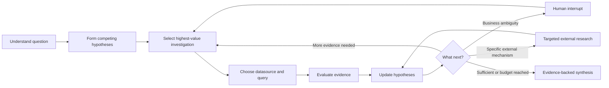

# Business Signals

An evidence-first, AI-powered root-cause investigation system for business anomalies. Business Signals connects independent operational databases, keeps competing explanations alive, chooses the next most informative investigation, and stops only when evidence is sufficient or the budget is exhausted.

It is a LangGraph decision loop—not a chatbot, BI dashboard, text-to-SQL wrapper, or scripted multi-agent sequence.

## What it demonstrates

- A genuinely cyclic LangGraph that selects, executes, evaluates, and reroutes investigations
- Cross-datasource reasoning without FDWs or a distributed SQL layer
- Deterministic schema discovery, fingerprints, and metadata caching
- Explicit hypotheses, supporting and contradicting evidence, and calibrated confidence
- Selective historical weather, FX, and news/event research using real public APIs
- LangGraph checkpointing and human clarification interrupts
- Read-only SQL AST validation, timeouts, row caps, and database-level read-only sessions
- Structured Server-Sent Events without exposing model chain-of-thought
- Reproducible synthetic benchmarks built around real external events and negative controls

## Experience

Ask a question such as:

> Why did outdoor-product revenue fall sharply in northern Italy during July?

The engine might first test whether the decline is demand- or supply-driven in TimescaleDB, carry the affected product IDs into a separate PostgreSQL catalog, discover a shared supplier, return to inventory history for temporal validation, and only then decide whether one targeted external event search is worthwhile.



## Repository layout

```text
apps/
  api/                 FastAPI + reusable LangGraph investigation engine
  web/                 React/TypeScript investigation workbench
docs/                  Architecture and evaluation notes
examples/
  data/                Versioned CSV fixtures loaded into the demo databases
  generators/          Deterministic PostgreSQL and TimescaleDB fixtures
  scenarios/           Ground-truth benchmark definitions and negative controls
  evaluate.py          Scenario result scorer
docker-compose.yml     Independent catalog and analytics databases
pyproject.toml         Python 3.12 package and test configuration
```

## Quick start

Requirements: Python 3.12+, Node 22.13+, Docker, and an OpenAI-compatible API key.

```bash
cp .env.example .env
python3.12 -m venv .venv
source .venv/bin/activate
pip install -e '.[dev]'
npm --prefix apps/web install
docker compose up -d --wait
```

The database initialization scripts create schema and load the checked-in CSV fixtures under `examples/data/`. Those files hold internal business records only; weather, FX, and historic-event data remains an external-research concern.

Start the API and web app in separate terminals:

```bash
make api
make web
```

Open `http://localhost:3000`. Add the two seeded connections:

| Name | Type | Port | Database | User / password |
| --- | --- | ---: | --- | --- |
| Product Catalog | PostgreSQL | 5433 | `catalog` | `investigator` / `investigator` |
| Sales Analytics | TimescaleDB | 5434 | `analytics` | `investigator` / `investigator` |

Use read-only credentials outside the disposable demo environment. Datasource definitions and discovered schemas are saved locally at `.business-signals/datasources.json` (or `DATASOURCE_STORE_PATH`) so they survive API restarts. The file is gitignored and created with owner-only permissions; it contains the credentials needed to restore local connections. Credentials are never serialized into graph state, API responses, events, logs, or model payloads. Delete a datasource in the UI to remove its saved definition and schema cache.

## API

```text
POST /api/datasources/test
POST /api/datasources
GET  /api/datasources
GET  /api/datasources/{id}/metadata   # cached schema; no database call
POST /api/datasources/{id}/refresh
DELETE /api/datasources/{id}

POST /api/investigations
GET  /api/investigations                 # local saved-run archive
DELETE /api/investigations              # delete all saved runs (when none are running)
GET  /api/investigations/{id}
DELETE /api/investigations/{id}
GET  /api/investigations/{id}/events       # SSE
POST /api/investigations/{id}/responses    # resume HITL interrupt
```

FastAPI exposes interactive OpenAPI documentation at `http://localhost:8000/docs`.

## Core design

The model plans and interprets; code owns facts and arithmetic. The engine sends compact structural metadata rather than full schemas, validates generated SQL as a single read-only statement, executes through the chosen adapter, and stores result rows as observations. Deterministic functions calculate period comparisons, segmentation, missingness, duplicates, distributions, correlation, anomalies, trend changes, and before/after effects.

PostgreSQL and TimescaleDB are separate adapter instances. Intermediate findings move through typed graph state. The `Datasource` contract is deliberately broader than SQL so ClickHouse, BigQuery, Snowflake, MongoDB, or Elasticsearch adapters can be added later without changing the investigation loop.

External specialists are not fan-out workers. The decision node can call at most one weather, economy/FX, or news/event capability when internal evidence suggests a concrete external mechanism. Their outputs always carry source, date range, confidence, and a `correlated` or `supporting` relationship; they cannot directly establish causation.

See [the architecture notes](docs/architecture.md) for trust boundaries and extension points.

## Safety

- Only one `SELECT` or `WITH … SELECT` statement is accepted.
- Data-changing and DDL AST nodes, comments, multiple statements, and `SELECT INTO` are rejected.
- Queries receive a hard maximum row count and statement timeout.
- PostgreSQL connections request `default_transaction_read_only=on`.
- Datasource credentials are saved only in the gitignored, owner-only local connection store and are excluded from LLM payloads, API responses, events, and logs.
- Every run has iteration, SQL-query, external-call, and wall-clock budgets.
- Low-evidence runs return “insufficient evidence” instead of inventing a cause.

The validator is defense in depth, not a substitute for a database role with minimal read permissions.

## Benchmarks

The checked-in scenarios cover payment regression, duplicate ingestion, supplier inventory, historical weather, FX-driven margin pressure, a major technology outage, and a storm negative control. Ground truth specifies expected evidence, allowed external routes, and forbidden conclusions.

```bash
python examples/evaluate.py \
  examples/scenarios/03-supplier-shortage.yaml \
  result.json
```

The score rewards correct cause and evidence, datasource routing, restraint with external tools, and query efficiency. It penalizes unsupported causal language and coincidental-event attribution. See [evaluation.md](docs/evaluation.md).

## Tests

```bash
pytest
npm --prefix apps/web run build
```

## Current scope

Datasource registrations and their schema cache survive local API restarts. Investigation records are archived locally under `.business-signals/investigations/` (or `INVESTIGATION_STORE_DIR`), with their question, human clarifications, hypotheses, evidence, and final analysis. LangGraph checkpoints are stored separately in the catalog PostgreSQL database, under the `business_signals` schema by default (`CHECKPOINT_DATABASE_URL` and `CHECKPOINT_SCHEMA`). This preserves the exact graph position and pending interrupt, so a paused clarification can resume after an API restart without repeating earlier steps. The Saved runs view can inspect or delete one archived run or all non-running runs. It implements PostgreSQL and TimescaleDB only, relies on live public services for optional external research, and expects an OpenAI-compatible model capable of reliable structured JSON. Durable encrypted credentials, organization authentication, and additional adapters are follow-on work.

## License

MIT
